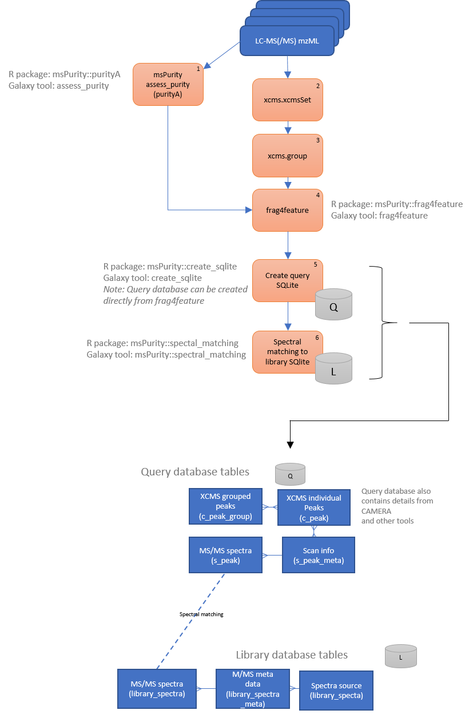

# Introduction

The msPurity package can perform spectral matching from a query SQLite database (containing the data from an LC-MS/MS experiment) against a library SQLite database.

The query SQLite database is generated either using `frag4feature` function with the option `create_db=True` or by using the `create_db` function. The query SQLite database contains information of the query LC-MS/MS run, e.g. file info, scan info, chromatographic peaks, group peaks, MS/MS spectral data. 

See [query database schema](query_sqlite_schema.html).


The default library SQLite database is in the msPurityData Bioconductor Data package and hashas been generated from data derived from [MoNA](http://mona.fiehnlab.ucdavis.edu/downloads). This contains data from FAHFA, GNPS, HMDB, RTX5 Fiehnlib, Vaniya/Fiehn Natural products library, Fiehn HILIC, Respect, MassBank, Lipidblast, MetaboBASE, Pathogen box and Riken IMS oxidised phospholpids. An alternative database is also provided that has been created just from MassBank using data directly from [MassBank](https://github.com/MassBank/MassBank-data). If a user would like to create their own spectral database, a python package can be used to generate the appropiate SQLite database from a collection of msp files, see [msp2db](https://msp2db.readthedocs.io/en/latest/).

See [library database schema](library_sqlite_schema.html).




# How to perform spectral matching for LC-MS/MS with XCMS and msPurity
We link the spectral matching result back to XCMS feature, therefore we need to run XCMS first. 

(Please use the appropiate settings for your data)

```{r results='hide', message=FALSE, warning=FALSE,  echo = TRUE}
library(msPurity)
msmsPths <- list.files(system.file("extdata", "lcms", "mzML", package="msPurityData"), full.names = TRUE, pattern = "MSMS")
xset <- xcms::xcmsSet(msmsPths, nSlaves = 1)
xset <- xcms::group(xset)
xset <- xcms::retcor(xset)
xset <- xcms::group(xset)
```

The `purityA` function is then called to calculate the precursor purity of the fragmentation results and the `frag4feature` function will links the 
fragmentation data back to the XCMS feature.

A SQLite database is also generated with the all the results included.

```{r results='hide', message=FALSE, warning=FALSE,  echo = TRUE}
pa  <- purityA(msmsPths)
pa <- frag4feature(pa, xset, create_db=TRUE)
```

The spectral matching is then run on all fragmentation scans collected in all files using the `spectral_matching` function. The function updates the query database with the spectral matching annotations.

As we have all the connections between fragmentation scans and XCMS features we can now see which XCMS feature has been annotated. A summary of the annotations for the XCMS grouped peaks is provided in the output. The scan_ids parameter can be omitted if all scans are to be used for spectral matching (recommended)

```{r results='hide', message=FALSE, warning=FALSE,  echo = TRUE}
result <- spectral_matching(target_db_pth = pa@db_path)
```


It should be noted that in a typical Data Dependent Acuisition (DDA) experiment not all the fragmentation scans collected can be linked backed to an associated XCMS features and in some cases the percentage of XCMS features with fragmentation spectra can sometimes be quite small.
